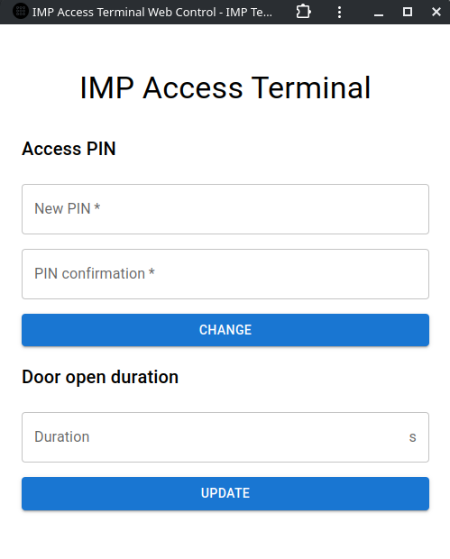
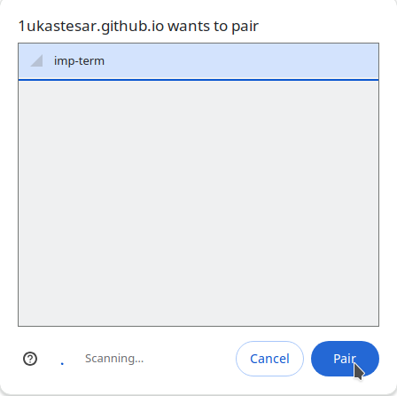

# IMP Access terminal - semestral project

## Description
This is an implementation of a simple access keypad system for ESP-32 in C with the help of ESP-IDF. It has configurable PIN code and a simple web interface for configuration.

## Features
- Configurable PIN code
- Web interface for configuration
- Simple UI
- Door open length, PIN code parameters and GPIO pins configurable at build-time (see `main/config.h`)

## Usage

### Building and flashing
#### Prerequisites
- ESP-IDF v5.3.1 (See [Get started](https://docs.espressif.com/projects/esp-idf/en/v5.3.1/esp32/get-started/index.html) guide)

#### Steps
1. Clone the repository:
```bash
git clone git@github.com:1ukastesar/fit-imp-term.git
```

2. Open the cloned repository:
```bash
cd fit-imp-term
```

3. Setup the environment
```bash
. $IDF_PATH/export.sh
```

> Replace `$IDF_PATH` with the path to your ESP-IDF installation. For example, if you have ESP-IDF installed in `~/esp/esp-idf`, the command would be `. ~/esp/esp-idf/export.sh`

4. Build the project
```bash
idf.py build
```

5. Connect the device to your computer using a USB cable

6. Flash the project
```bash
idf.py -p /dev/ttyUSB0 flash
```

> Replace `/dev/ttyUSB0` with the path to your ESP32 device.
>
> **On Linux**, you can use `sudo dmesg | grep tty` to find the correct path.
>
> **On Windows**, the path is usually `COMx`, where `x` is the port number (use `devmgmt.msc` to find the correct port number).

### Normal operation

#### Powering on
Just connect the device to power source and it will boot up.

#### Status LEDs
- **Blue onboard LED** - Indicates that the device is powered on.
- **Red onboard LED** - If blinking in a heartbeat pattern, indicates that the device is functioning correctly.
- **Red LED** - Indicates that the door is closed.
- **Green LED** - Indicates that the door is open.

#### Initial setup
On the first boot, the device will initialize default settings (configurable in `main/config.h`). This includes access PIN code to open the door and admin PIN code to change the access PIN.

#### Standard mode
In standard mode, the device will wait for the user to input the access PIN code. If the code is correct, the door will open (see **Door open state** section below).

> Enter the PIN code using the keypad and press `#` to confirm.

#### Admin mode
To enter admin mode, press `*` and enter the admin PIN code. The device will then ask you to enter the new access PIN code. Enter the new code and press `#`. Then enter the new code again to confirm and press `#`.

#### Error states
The device will enter FAIL state in these cases:
- Access PIN code is incorrect
- Admin PIN code is incorrect
- New access PIN code and its confirmation do not match
- Maximum PIN length (see `main/config.h`) is exceeded during PIN input

#### Security delay
In FAIL state, the red LED will blink 2 times and you have to wait for 2 seconds before trying again (security delay). Both LEDs are turned off to indicate that the security delay is active.

#### Door open state
When the door is open, the green LED will be turned on. The door will close automatically after a configurable amount of time (see `main/config.h`).

> You can immediately close the door in opened state by pressing any key on the keypad.

### Debug logs
The device logs most of the operations and important events.
To see debug logs, you can use the `idf.py monitor` command when the device is connected to your computer.

## Web configuration
### The project also comes with a simple web configuration. You can access it at [https://1ukastesar.github.io/fit-imp-term/](https://1ukastesar.github.io/fit-imp-term/).

It is written in React with the help of Material-UI and is hosted on GitHub Pages.

> If you prefer, you can download nvm, install npm and run the project locally by following these steps:
> ```bash
> cd web-control
> curl -o- \
> https://raw.githubusercontent.com/nvm-sh/nvm/v0.40.1/\
> install.sh \
> | bash
> nvm install 22
> npm install
> npm start
> ```

### Web configuration usage
1. Open the web configuration
2. You will see a page with two simple forms - one for setting the access PIN code and other one for door unlock duration change in seconds.

3. Enter the values you want to change:
   -  To change access PIN code, enter the new code in the first field, then the PIN confirmation in the second field and press "Set" button
   -  To change door unlock duration, enter the new duration in seconds in the third field and press "Update" button

4. A connection dialog will open. Select `imp-term` from the list and confirm with "Pair" button.



5. The page will try to update the device's settings:
   - If the device is not unlocked, you will be asked to unlock it first.


   - If the device is unlocked, the settings will be updated and you will see a success message.


   - If a network error occurs, you will see an error message.

6. You can now close the page.
